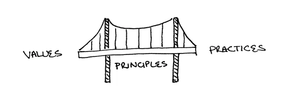

# XP Bridge — 価値・原則・プラクティスの関係性

エクストリームプログラミング（XP）の3層構造をインタラクティブにVisualizeしたApp

- **価値（Values）** をホバーすると、関連する原則・プラクティスがハイライト
- **原則（Principles）** をクリックすると、橋渡しする価値とプラクティスを表示
- **プラクティス（Practices）** をホバーすると、逆方向に価値までたどれる

## 元になった概念

Kent Beck 著『Extreme Programming Explained』第2版（2004）では、XPの構造を「価値（Values）」「原則（Principles）」「プラクティス（Practices）」の3層で説明し、原則が価値とプラクティスを橋渡し（bridge）する図が示されている。

<p align="center">
  
</p>

この図をより理解できるように、インタラクティブにホバーやクリックで操作することで、3層間の関係性を直感的に探索できるアプリケーションにした

## なぜ「Bridge」なのか？

XPの価値と原則は必ずしも1対1で対応しない。たとえば価値の「フィードバック」と原則の「相互利益」は直接的な対応関係を持たない。しかしプラクティスの層に降りると、**ペアプログラミング**のように両方を同時に体現するものが見つかる。

| 層 | 要素 | ペアプロとの関係 |
|---|---|---|
| 価値 | フィードバック | コードを書いたその瞬間にペアからレビューが得られる。フィードバックループが最短になる |
| 原則 | 相互利益 | 両者が知識を共有し合い、今の自分・相手・将来のチーム全員に利益をもたらす |
| プラクティス | ペアプログラミング | 上記の価値と原則を同時に橋渡しする具体的な実践 |

このように、プラクティスが「橋（Bridge）」となって離れた価値と原則を結びつけるのがXPの構造的な特徴であり、本アプリで可視化したいポイントである。

## Tech Stack

- React 18
- Vite 6
- カスタムSVGアイコン（外部依存なし）

### なぜ React か

本アプリはホバーやクリックに応じて多数の要素のハイライト状態が連動するUIであり、「状態が変わったらUIに反映する」という宣言的なモデルとの相性が良い。Vanilla JSで同等の連動を手続き的に管理すると、要素数の増加に伴いコードが煩雑になる。とはいえ、同規模のアプリであればSvelteやPreactでも十分実現可能。

## ローカル環境

```bash
npm install
npm run dev
```

http://localhost:5173 

## Deployment

### Option: Vercel（最も簡単）

**CLI から：**

```bash
npx vercel
```

初回は対話的にプロジェクトが作成され、以降は `git push` で自動Deployment。

**Git 連携：**

1. [vercel.com/new](https://vercel.com/new) でリポジトリをインポート
2. Framework Preset は自動検出（Vite）
3. Deploy をクリック

設定は `vercel.json` に含まれているため、追加設定は不要

### Option: Cloudflare Pages

**CLI から：**

```bash
npm run build
npx wrangler pages deploy dist --project-name=xp-bridge
```

**Git 連携（GitHub Actions）：**

1. Cloudflare ダッシュボードで API Token を作成（Edit Cloudflare Workers を選択）
2. GitHub リポジトリの Settings → Secrets に以下を追加：
   - `CLOUDFLARE_API_TOKEN`
   - `CLOUDFLARE_ACCOUNT_ID`
3. `main` ブランチに push すると `.github/workflows/cloudflare-pages.yml` が自動実行

### Option: 手動デプロイ

```bash
npm run build
```

`dist/` ディレクトリを任意の静的ホスティングにアップロード

## プロジェクト構成

```
xp-bridge-app/
├── index.html              # エントリーHTML
├── package.json
├── vite.config.js
├── vercel.json             # Vercel 設定
├── docs/
│   └── xp-bridge-original.png # 3層構造の概念図（原著より）
├── public/
│   └── favicon.svg
├── src/
│   ├── main.jsx            # React マウント
│   └── App.jsx             # XP Bridge コンポーネント
└── .github/
    └── workflows/
        └── cloudflare-pages.yml
```

## ライセンス
MIT
